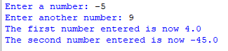
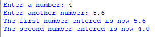

## Description
This program swaps the values of two numbers entered by the user if they have the same sign; otherwise, it places the sum of the two in the first number and their product in the second.
## Example
♡ Example 1  
  
♡ Example 2  
  
